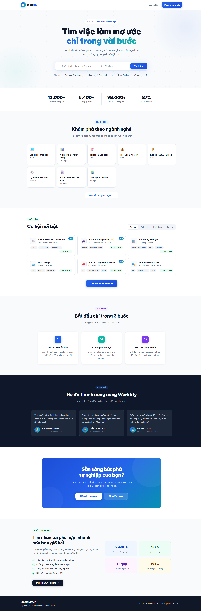
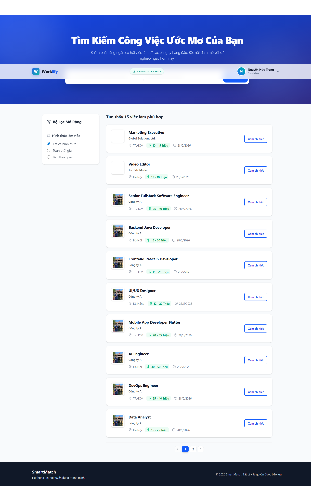
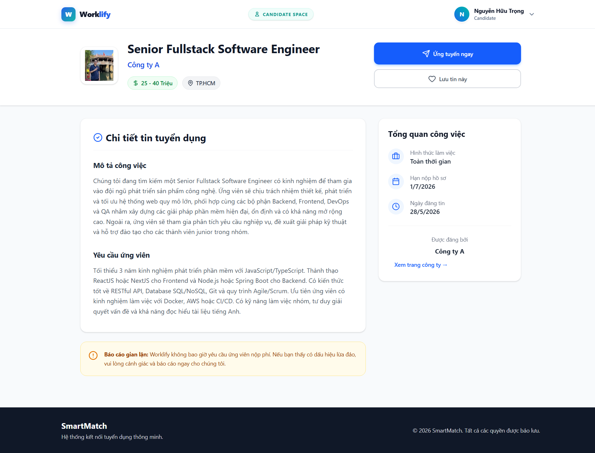
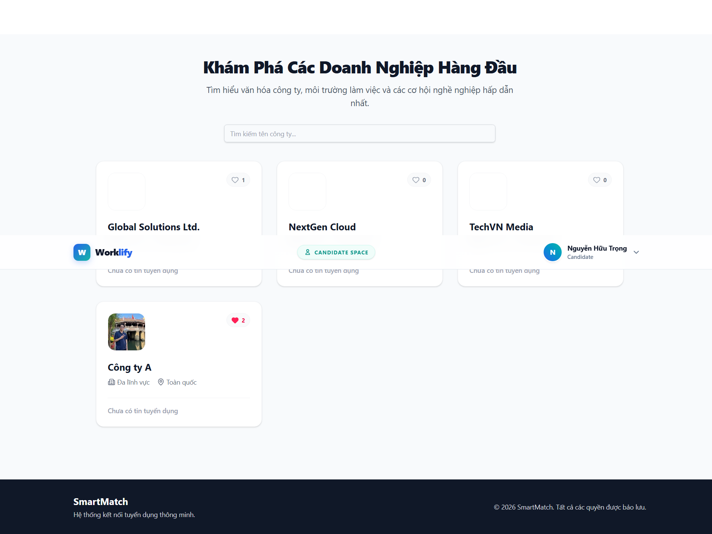
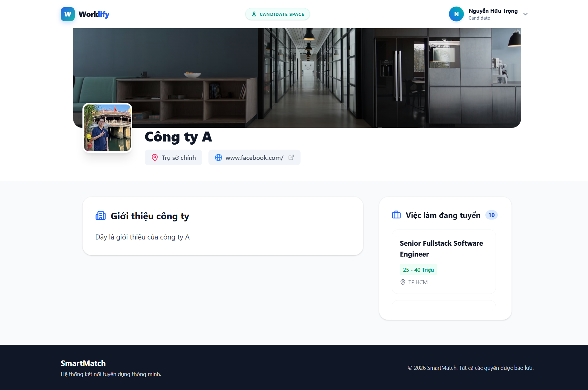
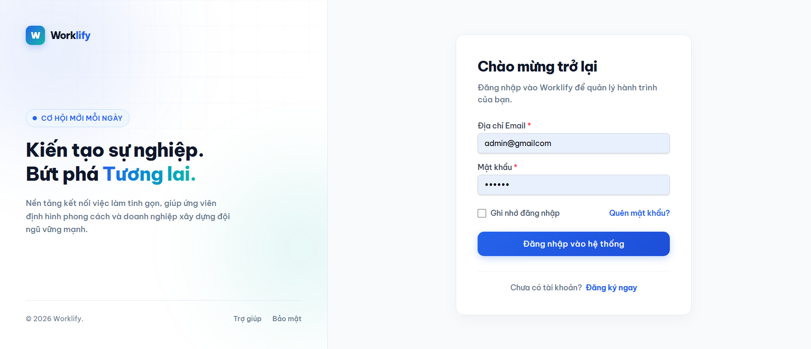
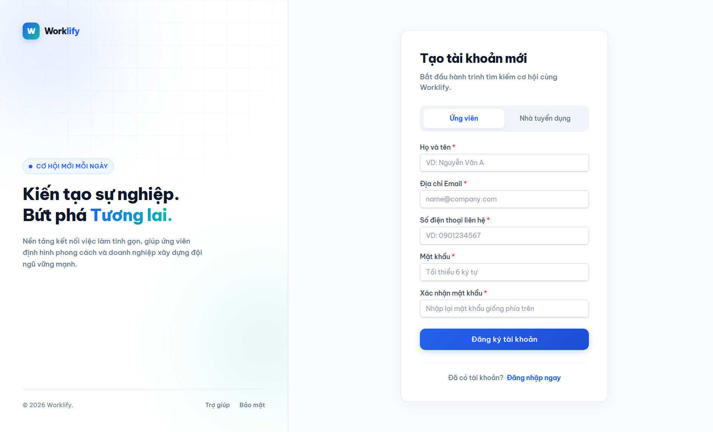
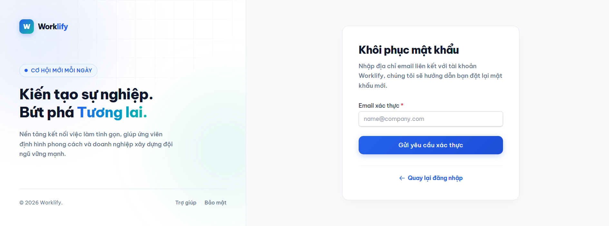

<div align="center">

# 🚀 Worklify — Nền Tảng Tuyển Dụng Thông Minh

[](https://youtube.com/your-demo-link)
[](https://worklify.demo.com)

---

<!-- TECH STACK BADGES -->


</div>

---

## 📖 Giới Thiệu Dự Án

**Worklify** là một nền tảng tuyển dụng thế hệ mới, được xây dựng với mục tiêu kết nối **ứng viên tài năng** và **nhà tuyển dụng uy tín** một cách hiệu quả và minh bạch nhất. Với giao diện hiện đại và luồng nghiệp vụ được thiết kế kỹ lưỡng, Worklify mang đến trải nghiệm tuyển dụng mượt mà cho cả ứng viên, nhà tuyển dụng lẫn quản trị viên hệ thống.

### ✨ Điểm Nổi Bật

- 🏛️ **Kiến Trúc Chuẩn Enterprise** — Backend được thiết kế theo mô hình **Domain-Driven Design (DDD)** kết hợp **Hexagonal Architecture (Ports & Adapters)**, đảm bảo tính bảo trì và mở rộng lâu dài.
- 🔐 **Bảo Mật Nhiều Lớp** — Xác thực bằng JWT, phân quyền rõ ràng cho 3 vai trò: `CANDIDATE`, `EMPLOYER`, `ADMIN`.
- 📂 **Quản Lý Hồ Sơ Toàn Diện** — Ứng viên upload CV (PDF), nhà tuyển dụng theo dõi và cập nhật trạng thái từng hồ sơ theo quy trình rõ ràng.
- 📊 **Quản Trị Mạnh Mẽ** — Hệ thống Admin với đầy đủ công cụ kiểm duyệt nội dung, quản lý người dùng và xuất báo cáo.

---

## 📸 Giao Diện Hệ Thống

> **Hướng dẫn:** Thay thế các placeholder `[Ảnh chụp màn hình]` bằng file ảnh thực tế của bạn.
> Ví dụ: ``

---

### 🌐 Khu Vực Công Khai & Xác Thực

<table>
  <tr>
    <td align="center" width="50%">
      <strong>🏠 Trang Chủ (Home Page)</strong><br/>
      
      <br/><sub>Giao diện chào đón với thanh tìm kiếm việc làm thông minh, danh sách công việc nổi bật và các công ty đối tác.</sub>
    </td>
    <td align="center" width="50%">
      <strong>💼 Danh Sách Việc Làm (Job List)</strong><br/>
      
      <br/><sub>Trang tìm kiếm và lọc việc làm theo nhiều tiêu chí: ngành nghề, địa điểm, mức lương, loại hình công việc.</sub>
    </td>
  </tr>
  <tr>
    <td align="center" width="50%">
      <strong>📄 Chi Tiết Việc Làm (Job Detail)</strong><br/>
      
      <br/><sub>Thông tin đầy đủ về vị trí tuyển dụng: mô tả công việc, yêu cầu kỹ năng, mức lương, thông tin công ty và nút nộp hồ sơ.</sub>
    </td>
    <td align="center" width="50%">
      <strong>🏢 Danh Sách Công Ty (Company List)</strong><br/>
      
      <br/><sub>Khám phá các doanh nghiệp đang tuyển dụng, xem thông tin tổng quan, quy mô và số lượng vị trí đang mở.</sub>
    </td>
  </tr>
  <tr>
    <td align="center" width="50%">
      <strong>🏬 Chi Tiết Công Ty (Company Detail)</strong><br/>
      
      <br/><sub>Hồ sơ doanh nghiệp chi tiết bao gồm mô tả, văn hóa công ty, hình ảnh và toàn bộ các việc làm đang tuyển.</sub>
    </td>
    <td align="center" width="50%">
      <strong>🔑 Đăng Nhập (Login)</strong><br/>
      
      <br/><sub>Giao diện đăng nhập bảo mật, hỗ trợ phân biệt vai trò người dùng và luồng quên mật khẩu.</sub>
    </td>
  </tr>
  <tr>
    <td align="center" width="50%">
      <strong>📝 Đăng Ký (Register)</strong><br/>
      
      <br/><sub>Đăng ký tài khoản mới với lựa chọn vai trò Ứng Viên hoặc Nhà Tuyển Dụng và xác thực dữ liệu đầu vào toàn diện.</sub>
    </td>
    <td align="center" width="50%">
      <strong>🔒 Quên Mật Khẩu (Forgot Password)</strong><br/>
      
      <br/><sub>Luồng khôi phục mật khẩu an toàn qua email với xác nhận OTP hoặc link đặt lại.</sub>
    </td>
  </tr>
</table>

---

### 👤 Không Gian Làm Việc — Ứng Viên (Candidate Workspace)

<table>
  <tr>
    <td align="center" width="50%">
      <strong>📊 Bảng Điều Khiển (Candidate Dashboard)</strong><br/>
      
      <br/><sub>Tổng quan cá nhân: số lượng hồ sơ đã nộp, trạng thái xử lý và các việc làm nổi bật đang tuyển dụng.</sub>
    </td>
    <td align="center" width="50%">
      <strong>📋 Xây Dựng CV (CV Builder)</strong><br/>
      
      <br/><sub>Công cụ tải lên và quản lý CV định dạng PDF. Xem trước file trực tiếp trên trình duyệt trước khi lưu.</sub>
    </td>
  </tr>
  <tr>
    <td align="center" width="50%">
      <strong>📬 Hồ Sơ Đã Nộp (My Applications)</strong><br/>
      
      <br/><sub>Theo dõi toàn bộ hồ sơ ứng tuyển với trạng thái thời gian thực: Đang xét duyệt, Đã xem, Phỏng vấn, Từ chối.</sub>
    <td align="center" width="50%">
      <strong>👤 Hồ Sơ Cá Nhân (Profile)</strong><br/>
      
      <br/><sub>Quản lý thông tin cá nhân, kinh nghiệm làm việc, học vấn, kỹ năng và mức lương kỳ vọng.</sub>
    </td>
  </tr>
  <tr>
    <td align="center" width="50%">
      <strong>⚙️ Cài Đặt Tài Khoản (Settings)</strong><br/>
      
      <br/><sub>Cập nhật mật khẩu, cài đặt thông báo email và quản lý quyền riêng tư tài khoản.</sub>
    </td>
    <td></td>
  </tr>
</table>

---

### 🏢 Không Gian Làm Việc — Nhà Tuyển Dụng (Employer Workspace)

<table>
  <tr>
    <td align="center" width="50%">
      <strong>📊 Bảng Điều Khiển (Employer Dashboard)</strong><br/>
      
      <br/><sub>Tổng quan doanh nghiệp: số lượng tin đăng, hồ sơ nhận được, tỉ lệ phản hồi và biểu đồ hoạt động tuyển dụng.</sub>
    </td>
    <td align="center" width="50%">
      <strong>🏬 Hồ Sơ Công Ty (Company Profile)</strong><br/>
      
      <br/><sub>Chỉnh sửa thông tin doanh nghiệp: logo, mô tả, lĩnh vực, quy mô, địa chỉ và trang mạng xã hội.</sub>
    </td>
  </tr>
  <tr>
    <td align="center" width="50%">
      <strong>📋 Quản Lý Tin Tuyển Dụng (Job Management)</strong><br/>
      
      <br/><sub>Bảng tổng hợp tất cả tin tuyển dụng: lọc theo trạng thái (Đang mở/Đã đóng/Chờ duyệt), chỉnh sửa và xóa nhanh.</sub>
    </td>
    <td align="center" width="50%">
      <strong>✏️ Tạo / Chỉnh Sửa Tin (Job Create / Edit)</strong><br/>
      
      <br/><sub>Form soạn thảo tin tuyển dụng đầy đủ: tiêu đề, mô tả (rich text), yêu cầu kỹ năng, mức lương, hạn nộp hồ sơ.</sub>
    </td>
  </tr>
  <tr>
    <td align="center" width="50%">
      <strong>📬 Danh Sách Hồ Sơ (Application List)</strong><br/>
      
      <br/><sub>Xem tất cả hồ sơ ứng tuyển cho từng vị trí, sắp xếp theo thời gian nộp, lọc theo trạng thái xử lý.</sub>
    </td>
    <td align="center" width="50%">
      <strong>🔍 Chi Tiết Hồ Sơ (Application Detail)</strong><br/>
      
      <br/><sub>Xem CV ứng viên (PDF viewer), thông tin cá nhân và cập nhật trạng thái xử lý hồ sơ.</sub>
    </td>
  </tr>
  <tr>
    <td align="center" width="50%">
      <strong>🔎 Tìm Kiếm Ứng Viên (Candidate Search)</strong><br/>
      
      <br/><sub>Chủ động tìm kiếm ứng viên theo kỹ năng, kinh nghiệm, địa điểm — không cần chờ ứng viên tự nộp.</sub>
    </td>
    <td align="center" width="50%">
      <strong>⚙️ Cài Đặt Tài Khoản (Employer Settings)</strong><br/>
      
      <br/><sub>Quản lý thông tin tài khoản, đổi mật khẩu và cài đặt thông báo tuyển dụng.</sub>
    </td>
  </tr>
</table>

---

### 🛡️ Không Gian Làm Việc — Quản Trị Viên (Admin Workspace)

<table>
  <tr>
    <td align="center" width="50%">
      <strong>📊 Bảng Điều Khiển Admin (Admin Dashboard)</strong><br/>
      
      <br/><sub>Toàn cảnh hệ thống: tổng người dùng, tin tuyển dụng, hồ sơ nộp và các biểu đồ thống kê theo thời gian.</sub>
    </td>
    <td align="center" width="50%">
      <strong>👥 Quản Lý Người Dùng (User Management)</strong><br/>
      
      <br/><sub>Xem, tìm kiếm và quản lý toàn bộ tài khoản (Ứng viên / Nhà tuyển dụng). Kích hoạt, vô hiệu hóa hoặc điều chỉnh quyền.</sub>
    </td>
  </tr>
  <tr>
    <td align="center" width="50%">
      <strong>✅ Kiểm Duyệt Tin Tuyển Dụng (Job Moderation)</strong><br/>
      
      <br/><sub>Xét duyệt các tin tuyển dụng chờ phê duyệt: đọc nội dung, phê duyệt hoặc từ chối với lý do cụ thể.</sub>
    </td>
    <td align="center" width="50%">
      <strong>🏢 Kiểm Duyệt Công Ty (Company Moderation)</strong><br/>
      
      <br/><sub>Xét duyệt hồ sơ doanh nghiệp mới đăng ký: kiểm tra thông tin pháp lý, logo và nội dung mô tả.</sub>
    </td>
  </tr>
  <tr>
    <td align="center" width="50%">
      <strong>🏷️ Quản Lý Danh Mục (Category Management)</strong><br/>
      
      <br/><sub>Thêm, sửa, xóa các danh mục ngành nghề và kỹ năng dùng chung trong toàn bộ hệ thống.</sub>
    </td>
    <td align="center" width="50%">
      <strong>📈 Xuất Báo Cáo (Report Export)</strong><br/>
      
      <br/><sub>Xuất báo cáo thống kê theo khoảng thời gian tùy chọn. Hỗ trợ xuất file Excel/CSV cho từng loại dữ liệu.</sub>
    </td>
  </tr>
</table>

---

## ⚙️ Tính Năng Chi Tiết

### 🌐 Khu Vực Công Khai & Xác Thực

| Trang | Mô tả chức năng |
|---|---|
| **Trang Chủ** | Banner chào đón, thanh tìm kiếm việc làm nhanh theo từ khóa và địa điểm, grid hiển thị việc làm nổi bật, danh sách công ty đối tác và lời kêu gọi hành động (CTA) đăng ký. |
| **Danh Sách Việc Làm** | Tìm kiếm full-text, bộ lọc đa chiều (danh mục, địa điểm, mức lương, loại hình: full-time/part-time/remote), phân trang, sắp xếp theo độ mới hoặc mức lương. |
| **Chi Tiết Việc Làm** | Thông tin toàn diện về vị trí. Ứng viên đã đăng nhập có thể nộp hồ sơ (upload CV PDF) trực tiếp. Hiển thị công ty liên quan và các vị trí tương tự. |
| **Danh Sách Công Ty** | Duyệt công ty theo tên, ngành nghề, quy mô. Mỗi card hiển thị logo, số tin đang tuyển. |
| **Chi Tiết Công Ty** | Mô tả doanh nghiệp, thông tin liên hệ, hình ảnh, văn hóa và toàn bộ vị trí đang mở tuyển dụng. |
| **Đăng Nhập / Đăng Ký** | Form xác thực với validation phía client và server. Trả về JWT token, lưu `localStorage`. Phân biệt luồng cho ứng viên và nhà tuyển dụng. |
| **Quên Mật Khẩu** | Yêu cầu đặt lại mật khẩu qua email, bảo vệ bằng token có thời hạn. |

---

### 👤 Không Gian Làm Việc — Ứng Viên

| Trang | Mô tả chức năng |
|---|---|
| **Dashboard** | Thống kê nhanh: tổng hồ sơ đã nộp, số đang xét duyệt, tỉ lệ phản hồi và danh sách việc làm mới nhất trên hệ thống. |
| **CV Builder** | Upload file PDF (CV) và xem trước trực tiếp trên trình duyệt. Quản lý phiên bản CV hiện tại được dùng khi ứng tuyển. |
| **My Applications** | Danh sách tất cả hồ sơ đã nộp với trạng thái từng bước trong quy trình tuyển dụng. |
| **Profile** | Form cập nhật thông tin cá nhân: họ tên, ảnh đại diện, số điện thoại, địa chỉ, tóm tắt bản thân, kỹ năng, kinh nghiệm, học vấn và mức lương mong muốn. |
| **Settings** | Đổi mật khẩu, tuỳ chọn nhận email thông báo, xóa tài khoản. |

---

### 🏢 Không Gian Làm Việc — Nhà Tuyển Dụng

| Trang | Mô tả chức năng |
|---|---|
| **Dashboard** | Tổng quan hiệu quả tuyển dụng: số tin đăng, hồ sơ nhận hôm nay/tuần này, tỉ lệ xét duyệt và biểu đồ xu hướng. |
| **Company Profile** | Cập nhật đầy đủ hồ sơ doanh nghiệp bao gồm upload logo (lưu local storage), mô tả, lĩnh vực, quy mô nhân sự và website. Hồ sơ cần Admin duyệt trước khi hiển thị công khai. |
| **Job Management** | Bảng quản lý tất cả tin với bộ lọc trạng thái. Thao tác nhanh: mở/đóng tuyển dụng, điều hướng chỉnh sửa, xóa tin. |
| **Job Create / Edit** | Form soạn thảo tin tuyển dụng đầy đủ với rich text editor cho phần mô tả, chọn danh mục, nhập kỹ năng yêu cầu, thiết lập mức lương và hạn nộp. Tin sau khi tạo sẽ chờ Admin duyệt. |
| **Application List** | Xem toàn bộ hồ sơ cho một vị trí cụ thể, lọc theo trạng thái và sắp xếp theo thời gian nộp. |
| **Application Detail** | Chi tiết hồ sơ ứng viên: xem CV (PDF viewer), thông tin cá nhân và khả năng cập nhật trạng thái xử lý. |
| **Candidate Search** | Nhà tuyển dụng chủ động tìm kiếm ứng viên trong hệ thống theo kỹ năng, kinh nghiệm năm và địa điểm mong muốn. |
| **Settings** | Quản lý thông tin tài khoản cá nhân, đổi mật khẩu và cài đặt thông báo. |

---

### 🛡️ Không Gian Làm Việc — Quản Trị Viên

| Trang | Mô tả chức năng |
|---|---|
| **Admin Dashboard** | Thống kê tổng thể hệ thống theo thời gian thực: tổng số người dùng, doanh nghiệp, tin đăng và hồ sơ. Biểu đồ tăng trưởng theo tháng. |
| **User Management** | Tìm kiếm, xem và quản lý toàn bộ tài khoản trong hệ thống (ứng viên và nhà tuyển dụng). Hỗ trợ phân trang và lọc theo vai trò. |
| **Job Moderation** | Duyệt tin tuyển dụng mới: Admin đọc nội dung, kiểm tra tính hợp lệ, phê duyệt (APPROVED) hoặc từ chối (REJECTED) với lý do được gửi thông báo về cho nhà tuyển dụng. |
| **Company Moderation** | Duyệt hồ sơ công ty: kiểm tra logo, mô tả và thông tin hợp lệ trước khi cho phép công ty hiển thị trên nền tảng và đăng tin. |
| **Category Management** | CRUD đầy đủ danh mục ngành nghề (Industry) và kỹ năng (Skill) — dữ liệu nền tảng phục vụ toàn bộ hệ thống lọc và tìm kiếm. |
| **Report Export** | Chọn khoảng thời gian và loại báo cáo, xuất dữ liệu thống kê ra file Excel/CSV để phân tích ngoài hệ thống. |

---

## 🏛️ Kiến Trúc Hệ Thống

Worklify được xây dựng trên nền tảng kiến trúc **Domain-Driven Design (DDD)** kết hợp với **Hexagonal Architecture (Ports & Adapters)**, đảm bảo sự tách biệt rõ ràng giữa logic nghiệp vụ và chi tiết hạ tầng kỹ thuật.

```
┌─────────────────────────────────────────────────────────────────────┐
│                        CLIENT / EXTERNAL                            │
│              (React App, Postman, Other Services)                   │
└────────────────────────────┬────────────────────────────────────────┘
                             │  HTTP/REST
┌────────────────────────────▼────────────────────────────────────────┐
│                        📡  LAYER 4: API                             │
│    (REST Controllers, Global Exception Handler, OpenAPI/Swagger)    │
│    com.worklify.api.*                                               │
└────────────────────────────┬────────────────────────────────────────┘
                             │  Calls Use Cases (Ports)
┌────────────────────────────▼────────────────────────────────────────┐
│                   🧠  LAYER 3: APPLICATION                          │
│    (Use Cases / Services, DTOs, Mappers, Input/Output Ports)        │
│    com.worklify.application.*                                       │
└───────────────┬────────────────────────────────┬────────────────────┘
                │ Depends on Domain              │ Calls Output Ports
┌───────────────▼────────────────┐  ┌────────────▼────────────────────┐
│      🔷  LAYER 1: DOMAIN       │  │   ⚙️  LAYER 2: INFRASTRUCTURE   │
│  (Entities, Value Objects,     │  │  (JPA Adapters, Security, JWT,  │
│   Repository Ports/Interfaces, │  │   RabbitMQ, File Storage)       │
│   Domain Events, Business      │  │   com.worklify.infrastructure.* │
│   Rules)                       │  │                                 │
│  com.worklify.domain.*         │  │  [Implements Output Ports from  │
│                                │  │   Application Layer]            │
└────────────────────────────────┘  └─────────────────────────────────┘
```

### 🔷 Layer 1: Domain — Trái Tim Nghiệp Vụ

> **Package:** `com.worklify.domain`

Đây là tầng **không phụ thuộc vào bất kỳ framework nào**. Chứa toàn bộ logic nghiệp vụ cốt lõi:

- **Entities & Aggregates** — Đối tượng nghiệp vụ chính (`Job`, `Candidate`, `Employer`, `JobApplication`, `SystemLog`...) với các thuộc tính được kiểm soát chặt chẽ (immutable via `@Builder`, private constructors).
- **Value Objects** — Các kiểu dữ liệu bất biến có ý nghĩa nghiệp vụ, ví dụ: `Email`, `PhoneNumber`, `Salary`.
- **Repository Interfaces (Output Ports)** — Các interface như `JobRepository`, `CandidateRepository`... định nghĩa *cách muốn* truy cập dữ liệu, không quan tâm *cách thực hiện*.
- **Domain Events** — Sự kiện nghiệp vụ (`JobApplicationSubmittedEvent`) được phát ra khi có hành động quan trọng, cho phép decoupling giữa các bounded context.

### 🧠 Layer 2: Application — Điều Phối Use Cases

> **Package:** `com.worklify.application`

Tầng này điều phối luồng xử lý nghiệp vụ và định nghĩa rõ ràng **Input Ports** (những gì hệ thống có thể làm) và gọi đến **Output Ports** (domain interfaces):

- **Application Services** — `JobService`, `AuthService`, `CandidateService`, `JobApplicationService`... triển khai từng use case cụ thể theo yêu cầu nghiệp vụ.
- **DTOs (Data Transfer Objects)** — Các object dùng để truyền dữ liệu qua lại giữa API layer và application layer, tách biệt hoàn toàn khỏi domain entity.
- **Port Interfaces** — Định nghĩa các hợp đồng (contract) cho hạ tầng như `FileStoragePort`, `DomainEventPublisher`.

### ⚙️ Layer 3: Infrastructure — Hiện Thực Hóa Kỹ Thuật

> **Package:** `com.worklify.infrastructure`

Tầng này **triển khai (implement)** tất cả các port được định nghĩa ở tầng Application và Domain:

- **Persistence Adapters** — Các class `*RepositoryAdapter` sử dụng Spring Data JPA để tương tác với MySQL. JPA Entity riêng biệt hoàn toàn với Domain Entity.
- **Security** — `JwtService`, `JwtAuthenticationFilter`, `CustomUserDetailsService` xử lý luồng xác thực và phân quyền.
- **Messaging** — `DomainEventRabbitMqDispatcher` phát và xử lý Domain Event nội bộ, phục vụ cho việc decoupling giữa các bounded context trong hệ thống.
- **File Storage** — `LocalFileStorageService` xử lý việc lưu trữ file (logo công ty, CV PDF) vào hệ thống file local.
- **Configuration** — `SecurityConfig`, `RabbitMqConfig`, `AuthConfig`, `WebConfig` cấu hình toàn bộ hạ tầng Spring Boot.

### 📡 Layer 4: API — Cổng Giao Tiếp

> **Package:** `com.worklify.api`

Tầng ngoài cùng, chịu trách nhiệm tiếp nhận yêu cầu HTTP và trả về phản hồi:

- **Controllers** — Tổ chức theo vai trò: `admin/`, `auth/`, `candidate/`, `employer/`, `job/`, `jobapplication/`, `file/`. Mỗi controller chỉ gọi đến Application Service (Input Port) tương ứng.
- **Global Exception Handler** — `GlobalExceptionHandler` (@RestControllerAdvice) xử lý tập trung tất cả các loại exception, đảm bảo API trả về cấu trúc lỗi nhất quán `ApiResponse<T>`.
- **OpenAPI / Swagger UI** — Tích hợp `springdoc-openapi` để tự động sinh tài liệu API tương tác.
- **Request Logging Filter** — `RequestLoggingFilter` ghi lại toàn bộ HTTP request/response để hỗ trợ debug và audit.

---

## 🚀 Hướng Dẫn Cài Đặt

### 📋 Yêu Cầu Môi Trường

| Công nghệ | Phiên bản tối thiểu |
|---|---|
| Java JDK | 21+ |
| Apache Maven | 3.9+ |
| Node.js | 18+ |
| MySQL | 8.0+ |
| Docker & Docker Compose | (Tuỳ chọn, khuyến nghị) |

---

### Bước 1 — Khởi Tạo Cơ Sở Dữ Liệu

```bash
# Đăng nhập MySQL và chạy script khởi tạo
mysql -u root -p < backend-core/init.sql
```

Sau khi chạy xong, database `worklify_db` cùng đầy đủ các bảng và dữ liệu mẫu ban đầu sẽ được tạo tự động.

---

### Bước 2 — Cấu Hình Backend Core (Spring Boot)

```bash
cd backend-core
```

Mở file `api/src/main/resources/application-dev.yml` và cập nhật thông tin kết nối:

```yaml
spring:
  datasource:
    url: jdbc:mysql://localhost:3306/worklify_db
    username: root          # ← Thay bằng username MySQL của bạn
    password: your_password # ← Thay bằng password MySQL của bạn

app:
  jwt:
    secret: your-super-secret-jwt-key-must-be-at-least-32-chars
    expiration: 86400000  # 24 giờ (milliseconds)
```

**Build và chạy:**

```bash
# Build toàn bộ multi-module project
./mvnw clean install -DskipTests

# Chạy ứng dụng ở profile dev
./mvnw spring-boot:run -pl api -Dspring-boot.run.profiles=dev
```

✅ Backend Core sẽ khởi động tại `http://localhost:8080`
📚 Swagger UI: `http://localhost:8080/swagger-ui/index.html`

---

### Bước 3 — Cài Đặt Frontend (React / Vite)

```bash
cd frontend-app

# Cài đặt dependencies
npm install
```

Tạo file `.env.local` trong thư mục `frontend-app`:

```env
VITE_API_BASE_URL=http://localhost:8080/api
```

**Khởi động development server:**

```bash
npm run dev
```

✅ Frontend sẽ khởi động tại `http://localhost:5173`

---

### 🐳 Khởi Động Bằng Docker Compose (Khuyến Nghị)

Để khởi động toàn bộ hệ thống (MySQL + Backend Core + Frontend) chỉ với một lệnh:

```bash
# Ở thư mục gốc của dự án
docker-compose up --build -d
```

Truy cập các service:

| Service | URL |
|---|---|
| 🌐 Frontend App | `http://localhost:5173` |
| 📡 Backend Core API | `http://localhost:8080` |
| 📚 Swagger UI | `http://localhost:8080/swagger-ui/index.html` |

---

## 📁 Cấu Trúc Thư Mục

```
da_SmartMatch/
├── 📁 backend-core/         # Spring Boot Multi-Module (DDD + Hexagonal)
│   ├── 📁 domain/           #   → Layer 1: Entity, Repository Interface, Domain Event
│   ├── 📁 application/      #   → Layer 2: Use Cases, Services, DTOs
│   ├── 📁 infrastructure/   #   → Layer 3: JPA, Security, File Storage
│   └── 📁 api/              #   → Layer 4: REST Controllers, Exception Handler
│
└── 📁 frontend-app/         # React + Vite + Tailwind CSS
    └── 📁 src/
        ├── 📁 pages/        #   → Toàn bộ các trang theo vai trò
        ├── 📁 components/   #   → Common, Layout, Shared components
        ├── 📁 features/     #   → Service layer gọi API theo tính năng
        └── 📁 router/       #   → React Router cấu hình phân quyền
```

---

## 👥 Đóng Góp

Mọi đóng góp đều được chào đón! Vui lòng đọc hướng dẫn sau:

1. Fork repository
2. Tạo feature branch: `git checkout -b feature/ten-tinh-nang`
3. Commit thay đổi: `git commit -m 'feat: Thêm tính năng ABC'`
4. Push lên branch: `git push origin feature/ten-tinh-nang`
5. Tạo Pull Request

---

## 📄 Giấy Phép

Dự án được phân phối theo giấy phép **MIT License**. Xem thêm tại file [`LICENSE`](./LICENSE).

---

<div align="center">

**Được xây dựng với ❤️ bởi Julian Nguyen**

[](https://github.com/your-username/worklify)
[](https://github.com/your-username/worklify)

</div>
